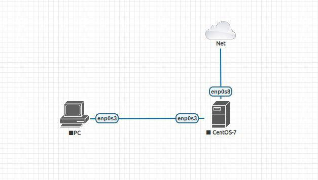
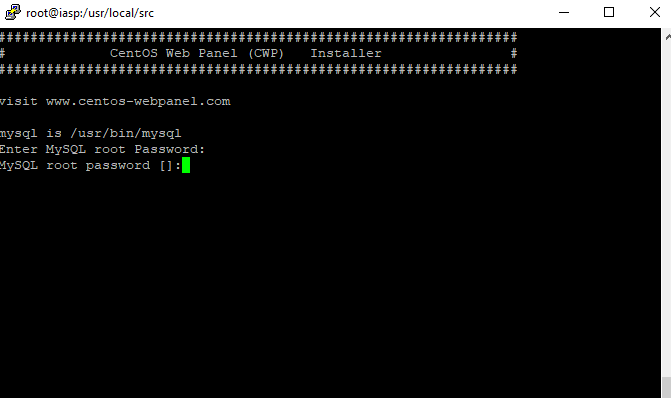
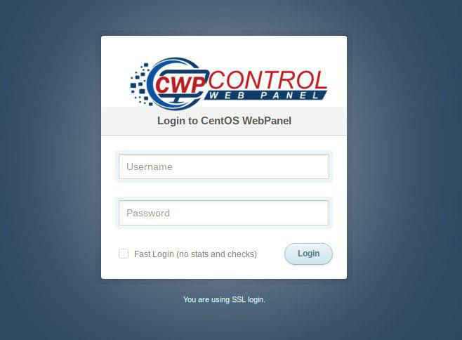
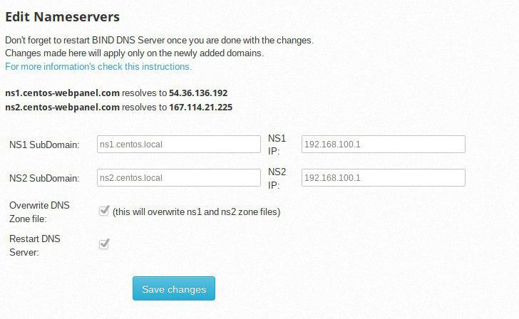
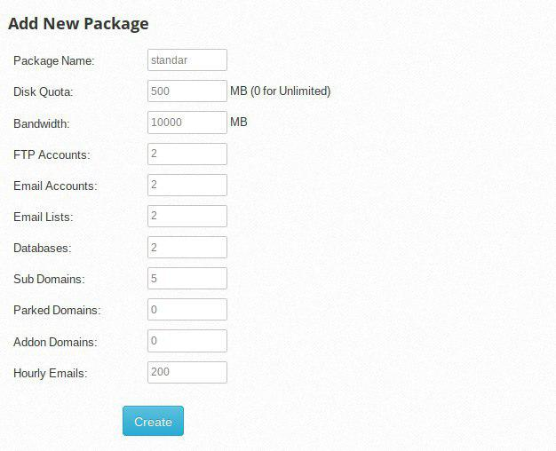
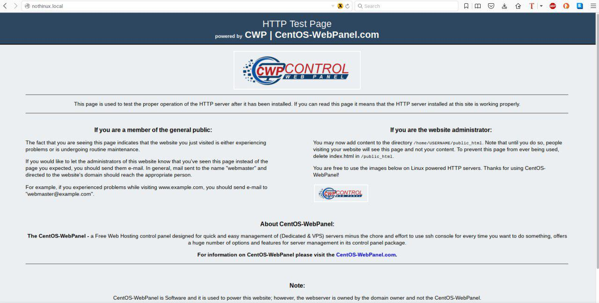
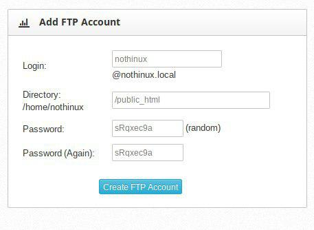

# Membangun Server Hosting menggunakan CWP CentOs 7 
## Bahan yang perlu di siapkan : 
- virtualbox
- iso centos 7 minimal/dvd
- koneksi internet

bagi Teman-teman yang belum punya centOS 7 nya, bisa di download di sini :
- http://sumberterbuka.beritagar.id/centos/7/isos/x86_64/CentOS-7-x86_64-Minimal-1708.iso 

- http://mirror.poliwangi.ac.id/centos/7/isos/x86_64/CentOS-7-x86_64-Minimal-1708.iso 
-  http://mirror.dionipe.net/Centos/7/isos/x86_64/CentOS-7-x86_64-Minimal-1708.iso 
- http://centos.biz.net.id/7/isos/x86_64/CentOS-7-x86_64-Minimal-1708.iso 
- http://repo.apiknet.co.id/centos/7/isos/x86_64/CentOS-7-x86_64-Minimal-1708.iso 
- http://centos.mirror.angkasa.id/centos/7/isos/x86_64/CentOS-7-x86_64-Minimal-1708.iso 
- http://mirror.nes.co.id/centos/7/isos/x86_64/CentOS-7-x86_64-Minimal-1708.iso 
- http://mirror.axarva.id/centos/7/isos/x86_64/CentOS-7-x86_64-Minimal-1708.iso

- utk lebih lengkapnya bisa lihat disini : 
https://www.centos.org/download/mirrors

## Apa itu centOS web panel
pertama Apa itu Centos Web Panel ? Centos Web panel adalah kontrol panel web hosting, dibuat untuk siapa saja yang ingin membuat sebuah server hosting, centos web panel ini menyuguhkan antarmuka web jadi anda tidak begitu perlu untuk mengakses lewat konsol ssh,centos web panel ini telah di lengkapi banyak komponen untuk membangun sebuah server hosting seperti web server, database server, ftp server, mail server dll

### Lebih jelasnya di bawah ini beberapa fitur dari centos web panel

- Apache Web Server (Mod Security - Automatic updated rules optional)
- PHP 5.6 (suPHP, SuExec - PHP version switcher)
- MySQL/MariaDB - phpMyAdmin
- Postfix - Dovecot - roundcube webmail (Antivirus, Spamassassin optional)
- CSF Firewall
- File System Lock (no more website hacking, all your files are locked from changes)
- Backups (optional)
- AutoFixer for server configuration

### 3rd Party Aplications
- CloudLinux - CageFS - PHP Selector
- Softaculous – Script Installer (Free and Premium)
- LiteSpeed Enterprise (Web Server)

### CentOS Web Panel (CWP) - Setups Server for Web Hosting (websites like WordPress…)
- API for easier account management, and whmcs billing api
- NAT-ed version, support for NAT-ed IPs
- Free Hosting Module, account activation provisioning for sites that
have a free hosting

### Web Server
- Varnish Cache server (improve your server performances up to three times)
- Nginx Reverse Proxy (get you static files delivered in the fastest way)
- LiteSpeed Enterprise integrated
- Compiles Apache from source (improves performance up to 15%)
- Apache reCompiler - Additional modules installation with one click
- Apache server status, configuration
- Apache Redirects Manager
- Edit apache vhosts, vhosts templates, include configuration
- Rebuild all apache Virtual hosts with one click
- suPHP & suExec (improved security)
- Mod Security: Comodo WAF, OWASP rules (one click install, automatic updates, easy management)
- Tomcat 8 server management & install in one click
- DoS protection from the Slow-Loris attacks
- Apache with spamhaus RBL protection (Protecting http PUT,POST,CONNECT)
- Perl cgi script support

### PHP
- Compiles PHP from source (improves up to 20% on performances)
- PHP Switcher (switch between PHP versions like: 5.2, 5.3, 5.4, 5.5, 5.6, 7.0, 7.1, 7.x)
- PHP Selector select PHP version per user or per folder (PHP 4.4, 5.2, 5.3, 5.4, 5.5, 5.6, 7.0, 7.1, 7.x)
- Simple php editor
- Simple php.ini generator in the users panel
- PHP addons with one click
- PHP.ini editor & PHP info & List modules
- php.ini per user account (you can add changes in /home/USER/php.ini)
- FFMPEG, For Video streaming websites)
- CloudLinux - PHP Selector
- ioncube, php-imap …

### User Management
- Add, List, Edit and Remove Users
- User Monitoring (list users open files, listening sockets…)
- Shell access management
- User Limit Managment (Quota and Inodes)
- Limit Processes: The maximum available number of processes per account.
- Limit Open Files: The maximum available number of open files per account.
- User FTP & File Manager
- CloudLinux - CageFS
- Dedicated IP per account

### DNS
- FreeDNS (Free DNS Server, no need for additional IPs)
- Add, Edit, List and Remove DNS zones
- Edit nameserver IPs
- DNS zone template editor
- New Easy DNS Zone Manager (with ajax)
- New DNS Zone list with Additional resolving information using google (also checking rDNS, nameservers….)

### Email
- postfix & dovecot
- MailBoxes, Alias
- Roundcube webmail
- Postfix Mail queue manager
- rDNS Checker Module (check you rDNS records)
- AntiSPAM (Spamhaus cronjob)
- SpamAssassin, RBL checking, AmaViS, ClamAV,OpenDKIM
- SPF & DKIM Integration
- Re-Build Postfix/Dovecot Mail server with (AntiVirus, AntiSpam Protection)
- Email Auto Responder
- Email Explore, read all mailboxes from one location.
- Mail Routing (local or remote MX Exchanger)

### System
- Hardware Information (CPU core and clock info)
- Memory Information (Memory usage info)
- Disk Info (Detailed Disk status)
- Software Info (kernel version, uptime…)
- Services Status (Quick services restart eg. Apache, FTP,Mail…)
- ChkConfig Manager (Quick list and manage your services)
- Services Monitor (automatic restart of services and email
notifications)
- Network port usage
- Network configuration
- SSHD configuration
- Auto-Fixer (checks important configuration and tries to auto-fix issues)
- Sysstat Graphs
Monitoring
- Live Monitoring (Monitor services eg. top, apache stats, mysql…)
- Use Java SSH Terminal/Console within panel
- Services Configuration (eg. Apache, PHP, MySQL…)
- Run shell commands in screen/background

### Security
- CSF Firewall (Best Linux Firewall)
- SSL generator
- SSL Certificate Manager (quick and easy installation of SSL Certs)
- Letsencrypt, Free SSL certificates for all your domains
- CloudLinux - CageFS
- CSF/LFD BruteForce protection
- IP access control
- Mod Security - OWASP rules (one click install, easy management)
- DoS protection from the Slow-Loris attacks (for Apache)
- File System Lock (no more website hacking, all your files are locked from changes)
- PHP now shows the script name and path in top or process lists
- Apache is limiting number of php processes per user
- Automated Backups
- Hide system and other user processes
- SFTP Security
- AutoSSL (automatically install Letsencrypt SSL certificate when creating new account, addon domain or subdomain)

### SQL
- MySQL Database Managment
- Add local or remote access user
- Live Monitor MySQL process list
- Create, Remove database
- Add additional users per database
- MySQL server configuration
- PhpMyAdmin (database managment)
- PostgreSQL, phpPgAdmin Support
- Remote MySQL support (remove mysql load from web server)
- MongoDB Manager/Installer

### Additional options
- TeamSpeak 3 Manager (Voice servers)
- Shoutcast Manager (Shoutcast streaming servers)
- Auto-update
- Backup manage r - File Manager
- Scripts folder “/scripts” over 15- scripts
- Virtual FTP users per domain
- cPanel Account Migration (restores files, databases and database users)
- Torrent SeedBox (one click install with Deluge WebGU)
- SSH key generator

## Ini adalah topologi yang akan di buat : 


centos 7 di vbox dengan 2 nic
nic pertama terhubung ke host os dengan mode host only
ip host : 192.168.100.2
ip centos : 192.168.100.1
nic kedua terhubung ke internet dengan Mode NAT/Bridge

untuk instalasi tidak akan saya bahas, rekan rekan bisa melihat tutorialnya disini https://www.tecmint.com/centos-7-installation/

aya hanya akan bahas intinya saja
- gunakan RAM 1 - 2GB
- HDD min 10GB
- pada zona waktu pilih Asia/Jakarta
- pilih minimal install
- Pemartisian pilih automatic partition saja
- pengaturan network ( hostname centos.centos.local : ip ether 1 : 192.168.100.1 ip ether 2 : DHCP )

eth1 dibuat static dan dibuat terhubung dengan host os dengan mode host only adapter
sedangkan eth2 menggunakan mode NAT atau bridge agar bisa terhubung ke internet, tapi pastikan host osnya terhubung ke internet

- lakukan pengecekan ip
```bash
ip addr show
```

pastikan enp0s3 memiliki ip 192.168.100.1

dan enp0s8 telah mendapat ip
bisa gunakan perintah 
```bash
dhclient -v enp0s8
```
- lalu lakukan ping ke google atau yang lain pastikan terkoneksi ke internet
- lalu update repository dengan yum update

`Total download size: 83 M
Is this ok [y/d/N]:` 
`di situ pilih N saja`

- Jika muncul seperti ini : 

Pastikan Anda Terkoneksi internet dengan BAGUS!

- Jika yang muncul seperti ini :

coba install sh cwp-latest lagi

- Jika muncul seperti ini : 

Maka hapus terlebih dahulu MySQLnya 
karena nanti proses penginstallan nya di gabung semua dengan installer cwp

- install wget
yum install wget

- install centOS web panelnya 
```bash
cd /usr/local/src
wget http://centos-webpanel.com/cwp-latest\
```

lalu install 
```bash 
sh cwp-latest
```

- install melalui bash script dari cwp

- lalu di update/mendownload nya, tunggu hingga selesai

- jika sudah selesai, akan muncul pesan seperti dibawah
```bash
#############################
#      CWP Installed        #
#############################

go to CentOS WebPanel Admin GUI at http://SERVER_IP:2030/

http://192.168.100.1:2030
SSL: https://192.168.100.1:2031
---------------------
Username: root
Password: ssh server root password
MySQL root Password: qrvyIoYhxMLD

#########################################################
          CentOS Web Panel MailServer Installer          
#########################################################
SSL Cert name (hostname): centos.centos.local
SSL Cert file location /etc/pki/tls/ private|certs
#########################################################

visit for help: www.centos-webpanel.com
Write down login details and press ENTER for server reboot!
Press ENTER for server reboot!
```


- nginstall cwp harus pake centos fresh install, jadi paket" kaya apache, nginx, mysql dll belum ke install
- Cwp itu kayak whm/cpanel, bedanya whm sama cpanel itu berbayar

- jika sudah silahkan akses link dibawah 

`http://192.168.100.1:2030
SSL: https://192.168.100.1:2031`
- jika mengakses yg menggunakan ssl nanti ada peringatan
- di add exception aja di browsernya
- login menggunakan user root : 


- setelah login maka akan di arahkan ke dashboard cwp
- lalu setup nameserver (klik dns function > edit nameserver)


- Lalu ke cwp setting > edit setting 


- lalu kita setup paket hosting
- paket hosting ini seperti paket hosting yang biasa ada pada penyedia hosting, kita bisa mengatur ukuran penyimpanan, jumlah akun ftp, akun emal, database dll
- klik package > add package


- set nama paket, disk quota, bw, ftp, email dll

- tinggal tentukan sendiri

- lalu kita setup akun pengguna

- sebelumnya anda login sebagai root, anda mempunyai akses untuk melakukan manajemen akun, hal ini sama dengan jika anda memiliki root whm anda dapat mengatur/mengelola semua akun cpanel


- set nama paket, disk quota, bw, ftp, email dll
- tinggal tentukan sendiri
- lalu kita setup akun pengguna
- sebelumnya anda login sebagai root, anda mempunyai akses untuk melakukan manajemen akun, hal ini sama dengan jika anda memiliki root whm anda dapat mengatur/mengelola semua akun cpanel

- klik user account > new account
3665.

- domain isi nama domain tanpa www

- server ip `192.168.100.1`

- `username` dan `password` harap di ingat atau dicatat karena nantinya akan digunakan

- bagian package, pilih paket yang telah dibuat tadi

- lalu save

- jika sukses akan muncul informasi seperti dibawah

```bash
Account Details
========================================
Server IP: 192.168.100.1
Web Panel Login: 
Domain: nothinux.local
Username: nothinux
Password: et4ter4ngk@nlah
Admin Email: nothinux@gmail.com

Panel URL: http://192.168.100.1:2030

NameServers:
ns1.centos.local
ns2.centos.local

Taufik Mulyana, [26.09.17 21:43]
sampai step ini website sudah bisa di akses

Taufik Mulyana, [26.09.17 21:44]
sebelumnya tambahkan
nothinux.local      192.168.100.1
di /etc/hosts pada host os
```
- untuk nama domain silahkan disesuaikan

- ini hasilnya : 


- saat di akses akan menampilkan halaman default cwp
- untuk bagian ini hanya bisa di host os yang menggunakan distro GNU/Linux
- untuk windows saya kurang tau 
- untuk yang windows coba ditambahkan di `c:\windows\system32\drivers\etc\hosts`
- windows : `https://support.rackspace.com/how-to/modify-your-hosts-file/`

```
Disini juga bisa membuat Real World, tingggal menyesuaikannya saja
```
- selanjutnya logout dari cwp
- lalu login lagi menggunakan akun user
- setelah login sebagai user
- ada beberapa opsi

### Jika ingin mengupload file ke hosting
- bisa menggunakan ftp
- buat dulu akun ftpnya
- klik file management > ftp account

- lalu gunakan filezilla client untuk melakukan upload
- atau bisa juga lewat ftp file manager
- klik file management > ftp file manager
- jika menggunakan cms, pasti membutuhkan database
- untuk membuat database klik sql service > mysql manager
- tinggal pilih + create database + user
- mungkin itu saja untuk saat ini

## Insyallah akan di lanjutkan
### Pemateri : Taufik Mulyana
```bash
Kulgram ini bisa diselenggarakan berkat kerjasama antara para kontributor di seluruh indonesia yang memang senang berbagi, bersama Cilsy Fiolution, startup yang bisa bantu masyarakat IT yg udah pusing belajar sendiri, agar bisa lebih cepat dan mudah dalam belajar dengan dipandu trainer yang selalu standby (website resminya disini cilsy.id).
````